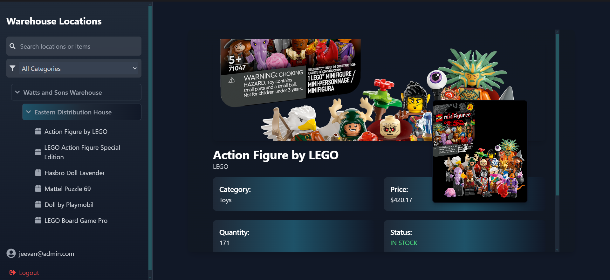

# <p align="center">Warehouse Management</p>

   

<p align="center">
  
</p>

**Warehouse Management** is a cutting-edge, responsive web application built with React. It streamlines warehouse location inventory management and has an intuitive user interface. Leveraging Firebase for authentication and data storage, this app ensures a secure and seamless experience for managing data your warehouse efficiently.

---

## Table of Contents

- [Warehouse Management](#warehouse-management)
  - [Table of Contents](#table-of-contents)
  - [Live Demo](#live-demo)
  - [Features](#features)
  - [Technologies Used](#technologies-used)
  - [Installation](#installation)
    - [Prerequisites](#prerequisites)
    - [Local Setup](#local-setup)
  - [Usage](#usage)

---

## Live Demo

[](https://youtu.be/IB_l_DUntUY)

*Click the image above to watch a demo of Warehouse Management in action.*

Visit the live application: [here](https://warehouse-management62p9.vercel.app/)

---

## Features

- **User Authentication:** Secure login and registration with Firebase Authentication, including Google Sign-In.
- **Responsive Design:** Optimized for both desktop and mobile devices for a seamless experience.
- **Inventory Management:** View and manage warehouse items effortlessly by location and category.
- **Dynamic Sidebar:** Interactive sidebar with expandable locations and categories for easy navigation.
- **Search & Filter:** Powerful search and filtering options to locate items quickly.
- **Detailed Item View:** Comprehensive item details with dynamic image loading and hover effects.
- **Notifications:** Real-time toast notifications for user actions and error handling.
- **Modern UI:** Sleek and intuitive user interface built with Tailwind CSS and React Icons.
- **Optimized Performance:** Efficient codebase ensuring fast load times and smooth interactions.

---

##  Technologies Used

 
 


---

## Installation

### Prerequisites

Before you begin, ensure you have met the following requirements:

- **Node.js** v14 or higher
- **npm** v6 or higher
- **Git** installed on your machine

### Local Setup

Follow these steps to set up the project locally:

1. **Clone the repository:**

   ```bash
   git clone https://github.com/your-username/warehouse-management.git
   cd warehouse-management
   ```
   
2. **Install dependencies:**   
  

    ```bash
     npm install
    ```
3. **Configure Firebase:**

  -  Create a Firebase project at Firebase Console.
  -  Enable Authentication and Firestore in your Firebase project.
  -  Replace the Firebase configuration variables with your own Firebase project credentials.

     ```bash
     REACT_APP_FIREBASE_API_KEY=your_api_key
     REACT_APP_FIREBASE_AUTH_DOMAIN=your_auth_domain
     REACT_APP_FIREBASE_PROJECT_ID=your_project_id
     REACT_APP_FIREBASE_STORAGE_BUCKET=your_storage_bucket
     REACT_APP_FIREBASE_MESSAGING_SENDER_ID=your_messaging_sender_id
     REACT_APP_FIREBASE_APP_ID=your_app_id
     ```

   - then seed data in the base
   - *ensure to change username and password*
     ```bash
       node seed.js
     ```
 5. **Start the development server:**

     ```bash
     npm start
     ```
      The application will run at http://localhost:3000.

---
### usage

 1. **Login:**

     -  Navigate to http://localhost:3000/login.
      - Use your email and password to log in or use Google Sign-In.


 2. **Register:**

      - Navigate to http://localhost:3000/register.
      - Create a new account using your email and password or Google Sign-In.


 3. **Dashboard:**

      - After logging in, you will be redirected to the dashboard.
      - Use the sidebar to navigate through different warehouse locations.
      -  Click on items to view detailed information.
    
 4. **Manage Items:**
    
      - Utilize search and filter functionalities to manage inventory efficiently.


